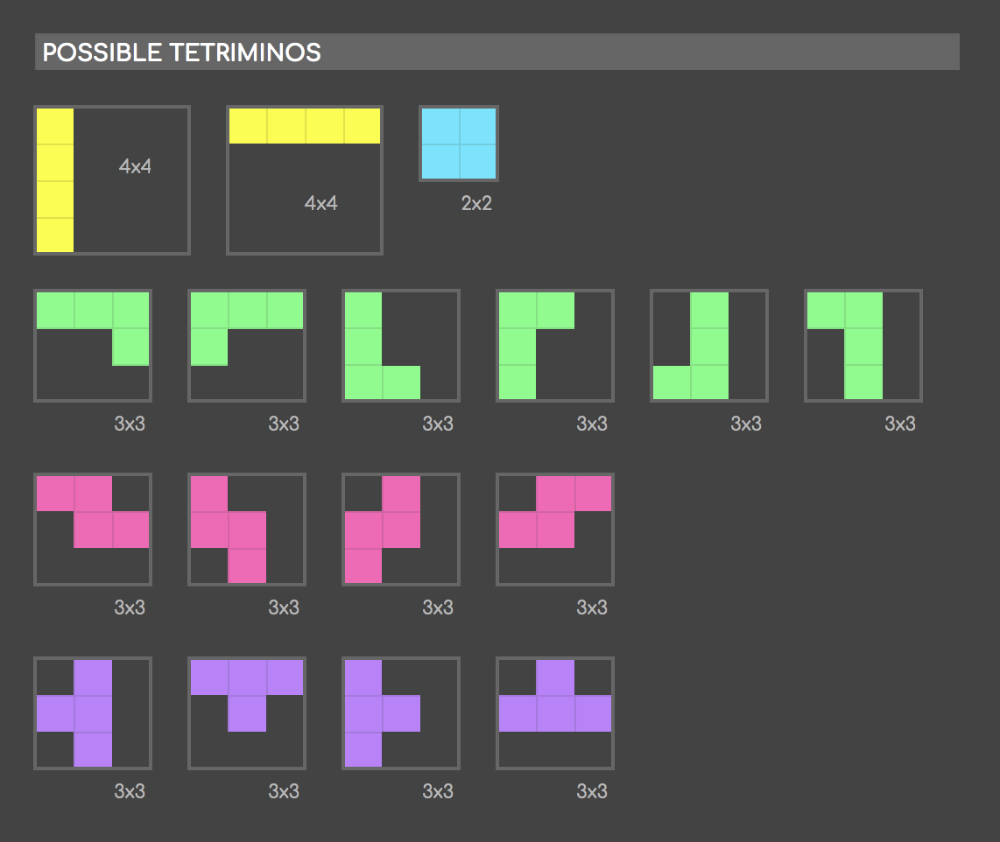
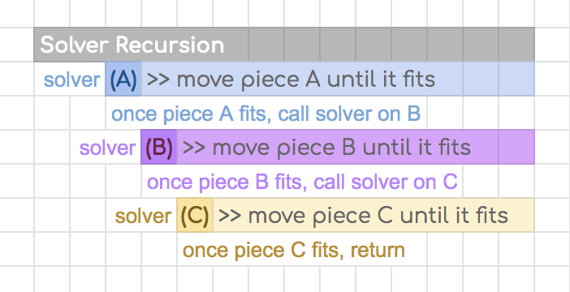

# 42Fillit
**Fit tetris pieces into the smallest square possible.**

[Subject](fillit.en.pdf)

 Input Sample (valid_2): 
Each tetraminos is represented with 4 lines of 4 characters, each followed by a new line. A Tetrimino is a classic piece of Tetris composed of 4 blocks. Each character must be either a block character(’#’) or an empty character (’.’). Each block of a Tetrimino must touch at least one other block on any of his 4 sides (up, down, left and right).

 Output Sample (output_valid_2): 
The program displays the smallest assembled square on the standard output. To identify each Tetrimino in the square solution, a capital letter will be assigned to each Tetrimino, starting with ’A’ and increasing for each new Tetrimino.

**Usage:** ./fillit source_file
> ./fillit ../correct_file/valid_2
 

**Solver**

The solver works using recursive **backtracking**. If the piece doesn't overlap any other pieces it places it on the map and then tries to call solve() on all of the other pieces. If they all fit with the current piece in place then it succeeds. If not it moves the current piece and tries to solve the rest of the pieces with the current piece in it's new place. If it's moved all the pieces and still can't make them fit on the current map then it exits the solver, makes a larger map, and then tries to solve again.

